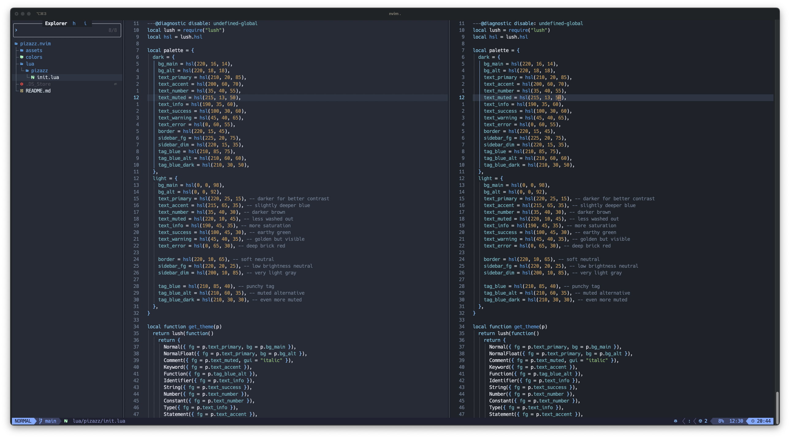

# estuary.nvim

A serene blue-themed Neovim colorscheme with both dark and light variants. A harmonious blend of blue tones with warm earth accents, like where water meets land.



## Features

- 🌊 **Serene blue-centered palette** with warm earth-tone accents
- 🌙 **Dark and light variants** for different preferences
- 🎯 **Comprehensive plugin support** including LSP, TreeSitter, and popular plugins
- 🔧 **Extensible architecture** with language and plugin-specific highlights
- 👁️ **Accessibility focused** with WCAG compliant contrast ratios
- 🎨 **Semantic color system** for consistent theming

## Installation

Using [lazy.nvim](https://github.com/folke/lazy.nvim):

```lua
{
  "ergusto/estuary.nvim",
  lazy = false,
  priority = 1000,
  config = function()
    vim.cmd([[colorscheme estuary_dark]]) -- or estuary_light
  end,
}
```

Using [vim-plug](https://github.com/junegunn/vim-plug):

```vim
Plug 'ergusto/estuary.nvim'
```

Using [packer.nvim](https://github.com/wbthomason/packer.nvim):

```lua
use {
  'ergusto/estuary.nvim',
  config = function()
    vim.cmd([[colorscheme estuary_dark]])
  end
}
```

## Usage

### Via Vim Commands

```vim
:colorscheme estuary_dark
:colorscheme estuary_light
```

### Via Lua

```lua
require("estuary").load("dark")   -- Load dark variant
require("estuary").load("light")  -- Load light variant
```

## Plugin Support

Estuary includes built-in support for:

- **LSP & Diagnostics** - Native Neovim LSP highlighting
- **TreeSitter** - Modern syntax highlighting
- **Telescope** - Fuzzy finder theming
- **GitSigns** - Git status integration
- **Lualine** - Statusline theming with mode-aware colors
- **Snacks.nvim** - File explorer and picker theming
- **And many more...**

## Color Palette

### Dark Theme

- **Background**: Deep blue-gray tones
- **Accent**: Bright cyan-blue for keywords and UI elements
- **Text**: Soft gray-white for excellent readability
- **Strings**: Warm green for natural contrast
- **Numbers**: Golden amber for warmth

### Light Theme

- **Background**: Soft blue-tinted whites
- **Accent**: Rich navy blue for keywords
- **Text**: Deep charcoal for clarity
- **Strings**: Forest green for readability
- **Numbers**: Warm brown-gold tones

## Architecture

Estuary uses a modular architecture with:

- **Semantic color naming** - Easy to understand and maintain
- **Language-specific highlights** - Optimized for different file types
- **Plugin extensions** - Expandable support for new plugins
- **No external dependencies** - Pure Lua implementation

## Contributing

Contributions are welcome! Please feel free to submit issues and pull requests.

## License

MIT License

